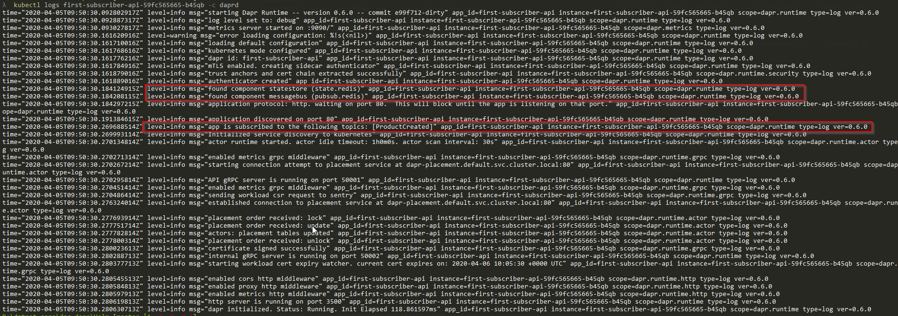
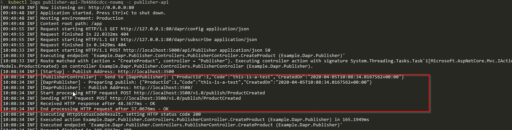
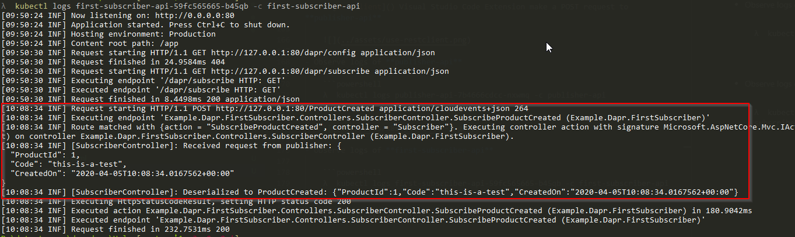
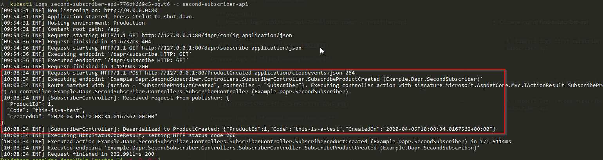

# Deploy to Kubernetes (k8s)

## Prerequisites

1. Install Docker for Desktop within Kubernetes
2. Download [Dapr CLI (currently is 0.6.0)](https://github.com/dapr/cli/releases/download/v0.6.0/dapr_windows_amd64.zip)

    ```powershell
    λ  dapr --version
    ```

    ```powershell
    CLI version: 0.6.0
    Runtime version: 0.6.0
    ```

3. Install Dapr to Kubernetes

    ```powershell
    dapr init --kubernetes
    ```
3. Install [Helm 3 (currently is 3.1.2)](https://get.helm.sh/helm-v3.1.2-windows-amd64.zip)

    ```powershell
    λ  helm version
    ```

    ```powershell
    version.BuildInfo{Version:"v3.1.2", GitCommit:"d878d4d45863e42fd5cff6743294a11d28a9abce", GitTreeState:"clean", GoVersion:"go1.13.8"}
    ```

## Build docker images for Apis

1. Build with `docker-compose`

    ```powershell
    docker-compose build
    ```

2. Verify

    ```powershell
    λ  docker images "example-*" --format "table {{.ID}}\t{{.Size}}\t{{.Repository}}\t{{.Tag}}"
    ```

    ```powershell
    IMAGE ID            SIZE                REPOSITORY                 TAG
    db4df09d7d8e        158MB               example-publisher          dev
    4623ae384858        158MB               example-secondsubscriber   dev
    99d539a3f453        158MB               example-firstsubscriber    dev
    ```

## Start Installing

```powershell
cd .\Helm
```

### Install Redis

```powershell
λ  helm install redis .\redis\
```

```powershell
NAME: redis
LAST DEPLOYED: Sun Apr  5 16:48:25 2020
NAMESPACE: default
STATUS: deployed
REVISION: 1
NOTES:
1. Get the application URL by running these commands:
  export POD_NAME=$(kubectl get pods --namespace default -l "app.kubernetes.io/name=redis,app.kubernetes.io/instance=redis" -o jsonpath="{.items[0].metadata.name}")
  echo "Visit http://127.0.0.1:8080 to use your application"
  kubectl --namespace default port-forward $POD_NAME 8080:80
```

### Configure Statestore & PubSub for Dapr

```powershell
λ  kubectl apply -f .\redis-components\
```

```powershell
component.dapr.io/messagebus created
component.dapr.io/statestore created
```

### Install Publisher

```powershell
λ  helm install publisher-api .\publisher-api
```

```poweshell
NAME: publisher-api
LAST DEPLOYED: Sun Apr  5 16:49:44 2020
NAMESPACE: default
STATUS: deployed
REVISION: 1
```

### Install FirstSubscriberApi

```powershell
λ  helm install first-subscriber-api .\first-subscriber-api
```

```powershell
NAME: first-subscriber-api
LAST DEPLOYED: Sun Apr  5 16:50:20 2020
NAMESPACE: default
STATUS: deployed
REVISION: 1
```

### Install SecondSubscriberApi

```powershell
λ  helm install second-subscriber-api .\second-subscriber-api
```

```powershell
NAME: second-subscriber-api
LAST DEPLOYED: Sun Apr  5 16:54:27 2020
NAMESPACE: default
STATUS: deployed
REVISION: 1
```

## Verify installation

### Get Pods

```powershell
λ  kubectl get po
```

```powershell
NAME                                     READY   STATUS    RESTARTS   AGE
dapr-operator-6bdfd5554-qqrjh            1/1     Running   0          29h
dapr-placement-846cd76b57-2v27s          1/1     Running   0          29h
dapr-sentry-6d46d5fbc6-4mx87             1/1     Running   0          29h
dapr-sidecar-injector-7849f77c4b-kkgkp   1/1     Running   1          46h
first-subscriber-api-59fc565665-b45qb    2/2     Running   0          5m4s
publisher-api-7b4666cdcc-nxwmq           2/2     Running   0          5m39s
redis-5c7b7d5b89-ftwqw                   1/1     Running   0          6m59s
second-subscriber-api-776bf669c5-pqwt6   2/2     Running   0          56s
```

### Observe logs of subscribers

- For example, below logs are retrieved from **first-subscriber-api**

```powershell
λ  kubectl logs first-subscriber-api-59fc565665-b45qb -c daprd
```




### Verify PubSub

- Use [RestClient]() Visual Studio Code Extension make a POST request to **publisher-api**

    

- Observe logs of **publisher-api**

    ```powershell
    λ  kubectl logs publisher-api-7b4666cdcc-nxwmq -c publisher-api
    ```

    

- Observe logs of **first-subscriber-api**

    ```powershell
    λ  kubectl logs first-subscriber-api-59fc565665-b45qb -c first-subscriber-api
    ```

    

- Observe logs of **second-subscriber-api**

    ```powershell
    λ  kubectl logs second-subscriber-api-776bf669c5-pqwt6 -c second-subscriber-api
    ```

    


## Cleanup

```powershell
λ  helm uninstall redis publisher-api first-subscriber-api second-subscriber-api
```

```powershell
release "redis" uninstalled
release "publisher-api" uninstalled
release "first-subscriber-api" uninstalled
release "second-subscriber-api" uninstalled
```

```powershell
λ  kubectl delete -f .\redis-components\
```

```powershell
component.dapr.io "messagebus" deleted
component.dapr.io "statestore" deleted
```

```powershell
λ  dapr uninstall --kubernetes
```

```powershell
Removing Dapr from your cluster...
Dapr has been removed successfully
```